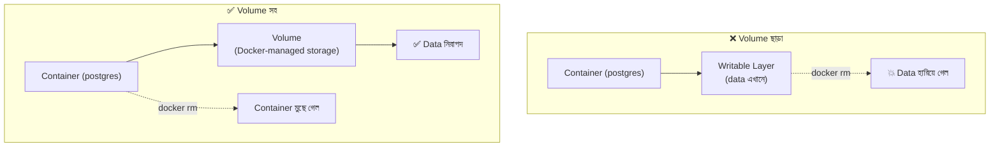
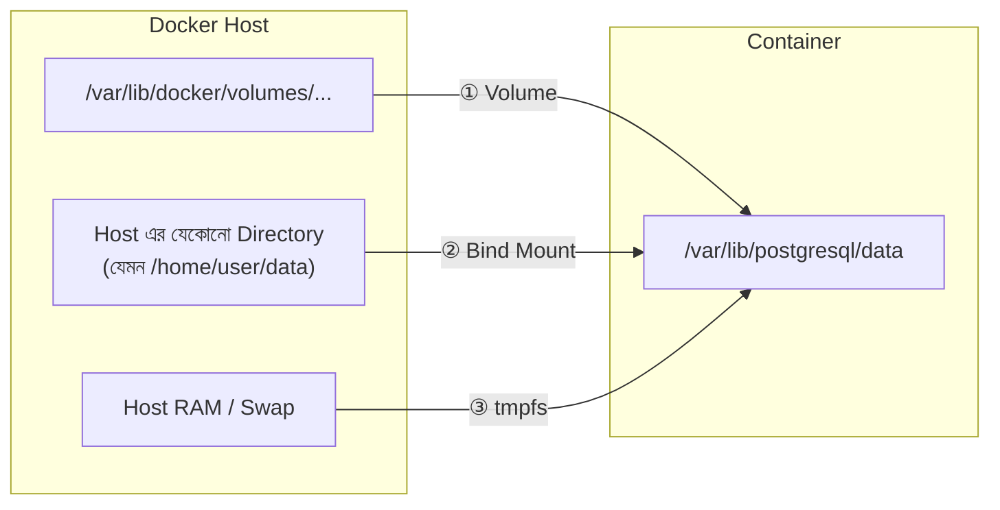
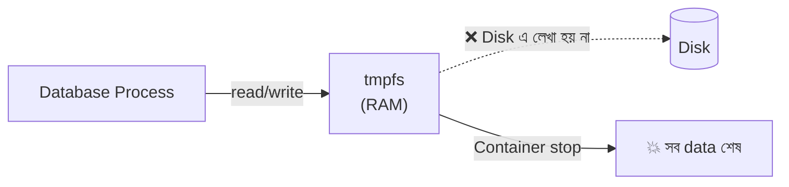

# 🐳 Docker Volume Mounting Methods for Databases

> **Production-Ready Technical Guide** — PostgreSQL, MySQL, MongoDB, SQL Server ও Redis এর জন্য Docker Storage এর সম্পূর্ণ গাইড।

---

## 📑 সূচিপত্র (Table of Contents)

- [Chapter 1: Docker Storage ও Database Persistence এর ভূমিকা](#chapter-1-docker-storage-ও-database-persistence-এর-ভূমিকা)
- [Chapter 2: Named Volumes (Recommended Approach)](#chapter-2-named-volumes-recommended-approach)
- [Chapter 3: Bind Mounts (Development ও Host Integration)](#chapter-3-bind-mounts-development-ও-host-integration)
- [Chapter 4: tmpfs Mounts (In-Memory Performance ও Caching)](#chapter-4-tmpfs-mounts-in-memory-performance-ও-caching)
- [Chapter 5: Advanced Configurations ও Production Best Practices](#chapter-5-advanced-configurations-ও-production-best-practices)
- [Chapter 6: Troubleshooting ও সাধারণ ভুল (Bonus)](#chapter-6-troubleshooting-ও-সাধারণ-ভুল-bonus)
- [Appendix A: Quick Cheat Sheet](#appendix-a-quick-cheat-sheet)
- [Appendix B: Repository Structure (প্রস্তাবিত)](#appendix-b-repository-structure-প্রস্তাবিত)

---

## 📌 এই গাইড কীভাবে ব্যবহার করবে

| কে পড়বে | কোন Chapter থেকে শুরু করবে |
|---|---|
| Beginner | Chapter 1 → 2 → 3 |
| Backend Developer | Chapter 2 → 3 → 6 |
| DevOps / SRE | Chapter 2 → 5 → 6 |
| শুধু quick reference চাইলে | [Appendix A](#appendix-a-quick-cheat-sheet) |

**Prerequisites:** Docker Engine 24+ (অথবা Docker Desktop) এবং Docker Compose v2 (`docker compose` command)।

> ⚠️ **Compose এর নোট:** আধুনিক Compose file এ উপরে `version: "3.8"` লেখার আর দরকার নেই। Compose v2 এ এটি obsolete এবং warning দেখায়, তাই এই গাইডের কোনো example এ `version:` key নেই।

---

# Chapter 1: Docker Storage ও Database Persistence এর ভূমিকা

## 1.1 কেন সাধারণ Container Filesystem এ Database চলে না? (Ephemerality)

Docker container এর ভেতরের filesystem হলো **ephemeral** (অস্থায়ী)। Image এর read-only layer এর উপর container এর জন্য একটা পাতলা **writable layer** (`overlay2` driver) তৈরি হয়। Database এর data ওই layer এ লিখলে নিচের সমস্যাগুলো হয়:

| সমস্যা | ব্যাখ্যা |
|---|---|
| **Data loss** | `docker rm` করলে writable layer সহ সব data মুছে যায় |
| **Upgrade সমস্যা** | Database image upgrade মানে নতুন container, আর নতুন container এ আগের data থাকে না |
| **Performance overhead** | `overlay2` এর Copy-on-Write (CoW) mechanism heavy write workload এ ধীর |
| **Tight coupling** | Data এর lifecycle container এর lifecycle এর সাথে বাঁধা পড়ে যায় |
| **Backup কঠিন** | Container এর ভেতরের layer থেকে data আলাদা করা ও manage করা ঝামেলার |



### দ্রুত প্রমাণ (নিজে চালিয়ে দেখো)

```bash
# 1. Volume ছাড়া একটা Postgres চালাও
docker run -d --name test-db -e POSTGRES_PASSWORD=secret postgres:17

# 2. একটা table বানাও
docker exec test-db psql -U postgres -c "CREATE TABLE demo(id int);"

# 3. Container মুছে ফেলো
docker rm -f test-db

# 4. আবার চালাও — আগের table আর নেই!
docker run -d --name test-db -e POSTGRES_PASSWORD=secret postgres:17
docker exec test-db psql -U postgres -c "\dt"   # Did not find any relations.
```

> 💡 **কিছু image আসলে অজান্তেই anonymous volume বানায়।** Official `postgres`, `mysql`, `mongo` image এর Dockerfile এ `VOLUME` instruction আছে। তাই `-v` না দিলেও Docker একটা random-নামের **anonymous volume** বানায়। কিন্তু নাম না থাকায় এটা হারিয়ে ফেলা বা ভুলে prune করে দেওয়া খুব সহজ। সবসময় **named volume** ব্যবহার করবে।

---

## 1.2 Docker এর তিনটি Storage Mechanism



### ① Volume (Named Volume)
Docker নিজে create ও manage করে। Linux এ data থাকে `/var/lib/docker/volumes/` এর নিচে। **Database এর জন্য সবচেয়ে ভালো ও recommended পদ্ধতি।**

### ② Bind Mount
Host machine এর একটা **নির্দিষ্ট path** সরাসরি container এ mount হয়। তুমি path নিয়ন্ত্রণ করো, Docker করে না। Development ও config/seed file inject করার জন্য আদর্শ।

### ③ tmpfs Mount
Data থাকে শুধু **host এর RAM (ও swap) এ**, disk এ কিছুই লেখা হয় না। Container বন্ধ হলেই data শেষ। Temporary ও ultra-fast workload এর জন্য।

---

## 1.3 তুলনামূলক বিশ্লেষণ (Architectural Comparison)

| বৈশিষ্ট্য | Named Volume | Bind Mount | tmpfs |
|---|---|---|---|
| **Data কোথায় থাকে** | `/var/lib/docker/volumes/<name>/_data` | Host এর যেকোনো path | Host RAM/Swap |
| **কে manage করে** | Docker | তুমি (user) | Kernel |
| **Container delete হলে data** | ✅ থাকে | ✅ থাকে | ❌ মুছে যায় |
| **Host reboot হলে data** | ✅ থাকে | ✅ থাকে | ❌ মুছে যায় |
| **Portability** | ⭐⭐⭐ উচ্চ | ⭐ কম (path-dependent) | N/A |
| **Backup সহজতা** | ⭐⭐⭐ (`docker volume` CLI) | ⭐⭐ (সাধারণ file backup) | N/A |
| **Permission সমস্যা** | কম (Docker handle করে) | **বেশি (UID/GID mismatch)** | কম |
| **Performance (Linux)** | নেটিভ speed | নেটিভ speed | 🚀 সবচেয়ে দ্রুত |
| **Performance (Win/macOS)** | ভালো (VM এর ভেতরে) | ⚠️ ধীর (VM file sharing) | 🚀 দ্রুত |
| **Host থেকে সরাসরি file দেখা** | কঠিন | ✅ সহজ | ❌ অসম্ভব |
| **Remote/Cloud storage driver** | ✅ (NFS, cloud plugin) | ❌ | ❌ |
| **Production DB এর জন্য** | ✅ **Recommended** | ⚠️ সীমিত ক্ষেত্রে | ❌ কখনোই নয় |

---

## 1.4 Production Database এ কোনটা কখন?

| Use Case | সুপারিশ | কারণ |
|---|---|---|
| **Production database data** | **Named Volume** | Portable, Docker-managed, backup সহজ |
| **Production এ dedicated SSD/disk** | Named Volume + `driver_opts` | নির্দিষ্ট disk এ রাখা যায়, তবুও Docker-managed |
| **Local development** | Named Volume (data) + Bind Mount (config/seed) | Data নিরাপদ, config সহজে edit করা যায় |
| **Init SQL / seed script inject** | Bind Mount (`:ro`) | Host থেকে file দিয়ে container এ পাঠানো |
| **Config file (`postgresql.conf`, `my.cnf`)** | Bind Mount (`:ro`) | Version control এ রাখা যায় |
| **CI/CD test database** | **tmpfs** | অতি দ্রুত, শেষে নিজে থেকেই পরিষ্কার |
| **Redis session/cache (data হারালে সমস্যা নেই)** | tmpfs অথবা Named Volume | Persistence লাগবে কিনা তার উপর নির্ভর |

### Database অনুযায়ী Data Path ও Container User

| Database | Data Path (container এর ভেতরে) | Default User (UID) | Init Script Path |
|---|---|---|---|
| **PostgreSQL** (≤17) | `/var/lib/postgresql/data` | `postgres` (999*) | `/docker-entrypoint-initdb.d/` |
| **PostgreSQL** (18+) | `/var/lib/postgresql` ⚠️ | `postgres` (999*) | `/docker-entrypoint-initdb.d/` |
| **MySQL** | `/var/lib/mysql` | `mysql` (999) | `/docker-entrypoint-initdb.d/` |
| **MariaDB** | `/var/lib/mysql` | `mysql` (999*) | `/docker-entrypoint-initdb.d/` |
| **MongoDB** | `/data/db` (+ `/data/configdb`) | `mongodb` (999) | `/docker-entrypoint-initdb.d/` |
| **SQL Server** | `/var/opt/mssql` | `mssql` (10001) | — |
| **Redis** | `/data` | `redis` (999) | — |

> \* Debian-based image এ সাধারণত 999; Alpine-based image এ আলাদা হতে পারে (যেমন `postgres:alpine` এ UID 70)। নিশ্চিত হতে চালাও: `docker run --rm postgres:17 id postgres`

> ⚠️ **PostgreSQL 18+ এর পরিবর্তন:** নতুন official image এ data directory এখন major-version-specific subdirectory তে থাকে, তাই volume mount করতে হয় `/var/lib/postgresql` এ (`/var/lib/postgresql/data` এ নয়)। Upgrade এর আগে অবশ্যই [official image এর README](https://hub.docker.com/_/postgres) দেখে নিও। এই গাইডের example এ `postgres:17` ব্যবহার করা হয়েছে, আর 18+ এর জন্য শুধু mount path বদলাতে হবে।

> ⚠️ **Init script সতর্কতা:** `/docker-entrypoint-initdb.d/` এর script **শুধু প্রথমবার** চলে, যখন data directory **খালি** থাকে। Data আগে থেকে থাকলে script আর চলবে না।

---

# Chapter 2: Named Volumes (Recommended Approach)

## 2.1 Named Volume কী?

Named Volume হলো Docker এর নিজস্ব persistent storage unit, যার একটা **নাম** আছে। তুমি শুধু নাম দাও, কোথায় ও কীভাবে data রাখা হবে তা Docker ঠিক করে।

**Linux এ কোথায় থাকে:**

```
/var/lib/docker/volumes/
└── pgdata/                  ← volume এর নাম
    └── _data/               ← আসল data এখানে
```

```bash
# Volume এর বিস্তারিত দেখো
docker volume inspect pgdata
```

```json
[
    {
        "CreatedAt": "2026-10-07T09:00:00+06:00",
        "Driver": "local",
        "Labels": {},
        "Mountpoint": "/var/lib/docker/volumes/pgdata/_data",
        "Name": "pgdata",
        "Options": null,
        "Scope": "local"
    }
]
```

> 📝 **Docker Desktop (Windows/macOS) এ:** Docker একটা ছোট Linux VM এর ভেতরে চলে, তাই `/var/lib/docker/volumes/` তোমার নিজের PC এর filesystem এ নেই, VM এর ভেতরে। সরাসরি ওই path এ গিয়ে file edit করার চেষ্টা করো না, দরকার হলে helper container দিয়ে access করো।

> 🚫 **কখনো `/var/lib/docker/volumes/` এর ভেতরের file সরাসরি edit/delete করো না।** সবসময় Docker CLI বা container এর মাধ্যমে access করো।

### Named Volume এর বিশেষ আচরণ (Copy-up)
কোনো **খালি named volume** প্রথমবার container এ mount হলে, mount point এ image এর যে content আগে থেকে ছিল তা volume এ **copy হয়ে যায়**। Bind mount এ এটা হয় না, বরং bind mount container এর ওই directory এর original content ঢেকে (shadow করে) দেয়।

---

## 2.2 Step-by-Step: Docker CLI দিয়ে

### Step 1: Volume তৈরি করো

```bash
# একটা named volume বানাও (না বানালেও -v দিলে Docker নিজে বানিয়ে নেয়)
docker volume create pgdata
```

### Step 2: Volume সহ Database চালাও

```bash
docker run -d \
  --name pg-prod \
  -e POSTGRES_USER=appuser \
  -e POSTGRES_PASSWORD=ChangeMe_Strong#123 \
  -e POSTGRES_DB=appdb \
  -e PGDATA=/var/lib/postgresql/data/pgdata \
  -v pgdata:/var/lib/postgresql/data \
  -p 5432:5432 \
  --restart unless-stopped \
  postgres:17

# ── Parameter ব্যাখ্যা ──────────────────────────────────────────────
# -d                  : Background (detached) mode এ চালাও
# --name pg-prod      : Container এর নাম
# -e POSTGRES_USER    : Superuser এর নাম (default: postgres)
# -e POSTGRES_PASSWORD: Superuser এর password (প্রথমবার initialize এর সময় সেট হয়)
# -e POSTGRES_DB      : প্রথমবার যে database auto-create হবে
# -e PGDATA           : Data কোন subdirectory তে থাকবে (নিচের নোট দেখো)
# -v pgdata:/var/...  : <volume-name>:<container-path> — এটাই মূল persistence
# -p 5432:5432        : <host-port>:<container-port>
# --restart           : Host/Docker restart হলে container আবার চালু হবে
```

> 💡 **কেন `PGDATA` একটা subdirectory তে?** কিছু storage (যেমন ext4 এর mount point) এর root এ `lost+found` folder থাকে। Postgres `initdb` খালি directory আশা করে, তাই `lost+found` থাকলে fail করে। Subdirectory ব্যবহার করলে এই সমস্যা এড়ানো যায়।

### Step 3: Data persist হচ্ছে কিনা পরীক্ষা করো

```bash
# 1. Data লেখো
docker exec pg-prod psql -U appuser -d appdb \
  -c "CREATE TABLE users(id serial PRIMARY KEY, name text);" \
  -c "INSERT INTO users(name) VALUES ('Abdullah');"

# 2. Container সম্পূর্ণ মুছে ফেলো
docker rm -f pg-prod

# 3. একই volume দিয়ে নতুন container চালাও
docker run -d --name pg-prod \
  -e POSTGRES_USER=appuser \
  -e POSTGRES_PASSWORD=ChangeMe_Strong#123 \
  -e POSTGRES_DB=appdb \
  -e PGDATA=/var/lib/postgresql/data/pgdata \
  -v pgdata:/var/lib/postgresql/data \
  -p 5432:5432 \
  postgres:17

# 4. Data আছে কিনা দেখো
docker exec pg-prod psql -U appuser -d appdb -c "SELECT * FROM users;"
#  id |   name
# ----+----------
#   1 | Abdullah
```

### অন্যান্য Database এর CLI Example

```bash
# ───────── MySQL ─────────
docker run -d --name mysql-prod \
  -e MYSQL_ROOT_PASSWORD=RootPass#123 \
  -e MYSQL_DATABASE=appdb \
  -v mysqldata:/var/lib/mysql \
  -p 3306:3306 \
  mysql:8.4

# ───────── MongoDB ─────────
docker run -d --name mongo-prod \
  -e MONGO_INITDB_ROOT_USERNAME=admin \
  -e MONGO_INITDB_ROOT_PASSWORD=MongoPass#123 \
  -v mongodata:/data/db \
  -v mongoconfig:/data/configdb \
  -p 27017:27017 \
  mongo:7

# ───────── SQL Server ─────────
docker run -d --name sql-prod \
  -e ACCEPT_EULA=Y \
  -e MSSQL_SA_PASSWORD='YourStrong@Pass123' \
  -v sqldata:/var/opt/mssql \
  -p 1433:1433 \
  mcr.microsoft.com/mssql/server:2022-latest

# ───────── Redis (AOF persistence সহ) ─────────
docker run -d --name redis-prod \
  -v redisdata:/data \
  -p 6379:6379 \
  redis:7 redis-server --appendonly yes
  # --appendonly yes : প্রতিটি write disk এ log হবে, তাই restart এ data থাকবে
```

### `--mount` syntax (আরও explicit ও readable)

`-v` ও `--mount` একই কাজ করে। তবে `--mount` বেশি স্পষ্ট এবং ভুল হলে error দেয় (silently কিছু বানিয়ে ফেলে না)।

```bash
docker run -d --name pg-prod \
  -e POSTGRES_PASSWORD=ChangeMe_Strong#123 \
  --mount type=volume,source=pgdata,target=/var/lib/postgresql/data \
  postgres:17

# type=volume   : mount এর ধরন (volume | bind | tmpfs)
# source=pgdata : volume এর নাম
# target=...    : container এর ভেতরের path
# readonly      : (optional) শুধু read-only করতে শেষে ",readonly" যোগ করো
```

---

## 2.3 Production-Ready Docker Compose (Named Volume + Driver Options)

### ক) Standard Production Configuration

```yaml
# docker-compose.yml
services:
  postgres:
    image: postgres:17.2              # ⚠️ 'latest' নয়, নির্দিষ্ট version pin করো
    container_name: pg-prod
    restart: unless-stopped           # Host reboot এর পর আবার চালু হবে
    environment:
      POSTGRES_USER: appuser
      POSTGRES_DB: appdb
      # Password সরাসরি না লিখে Docker secret file থেকে পড়ো (নিচের secrets section দেখো)
      POSTGRES_PASSWORD_FILE: /run/secrets/db_password
      PGDATA: /var/lib/postgresql/data/pgdata   # lost+found সমস্যা এড়াতে subdirectory
    secrets:
      - db_password
    volumes:
      - pgdata:/var/lib/postgresql/data          # ① Named volume (আসল data)
      - ./config/postgresql.conf:/etc/postgresql/postgresql.conf:ro   # ② Config (read-only bind)
      - ./initdb:/docker-entrypoint-initdb.d:ro  # ③ Init script (শুধু প্রথমবার চলে)
    command: postgres -c config_file=/etc/postgresql/postgresql.conf
    ports:
      - "127.0.0.1:5432:5432"         # শুধু localhost এ expose; পুরো internet এ নয়!
    shm_size: 256mb                   # Postgres এর shared memory (default 64MB কম)
    healthcheck:
      test: ["CMD-SHELL", "pg_isready -U appuser -d appdb"]
      interval: 10s
      timeout: 5s
      retries: 5
      start_period: 20s
    stop_grace_period: 60s            # Database কে নিরাপদে shutdown করার সময় দাও
    deploy:
      resources:
        limits:
          cpus: "2.0"
          memory: 2G
    logging:
      driver: json-file
      options:
        max-size: "10m"               # Log file বড় হয়ে disk ভরে ফেলা ঠেকায়
        max-file: "5"
    networks:
      - backend

volumes:
  pgdata:                             # Named volume declaration
    name: myapp_pgdata                # নির্দিষ্ট নাম (project prefix ছাড়া)
    labels:
      app: myapp
      backup: "daily"

networks:
  backend:

secrets:
  db_password:
    file: ./secrets/db_password.txt   # ⚠️ এই file কখনো Git এ commit করো না (.gitignore এ দাও)
```

```bash
# Secret file বানাও (permission সহ)
mkdir -p secrets && printf 'ChangeMe_Strong#123' > secrets/db_password.txt
chmod 600 secrets/db_password.txt
echo "secrets/" >> .gitignore

# চালু করো
docker compose up -d

# Status ও health দেখো
docker compose ps
docker compose logs -f postgres
```

### খ) Driver Options সহ Named Volume (নির্দিষ্ট Disk এ রাখা)

Production এ প্রায়ই database এর জন্য আলাদা **SSD/NVMe disk** থাকে (যেমন `/mnt/nvme/pgdata`)। `local` driver এর `driver_opts` দিয়ে Docker-managed volume কে সেই path এ বসানো যায়।

```yaml
volumes:
  pgdata:
    driver: local
    driver_opts:
      type: none                      # কোনো নির্দিষ্ট filesystem type নয়
      o: bind                         # আসলে একটা bind হিসেবে কাজ করবে
      device: /mnt/nvme/pgdata        # ⚠️ এই directory আগে থেকে তৈরি থাকতে হবে!
```

```bash
# চালানোর আগে directory ও ownership ঠিক করো
sudo mkdir -p /mnt/nvme/pgdata
sudo chown 999:999 /mnt/nvme/pgdata   # Postgres container user এর UID:GID
sudo chmod 700 /mnt/nvme/pgdata       # Postgres এই permission ছাড়া start হবে না
```

> ⚠️ এই পদ্ধতিতে volume টা দেখতে named volume হলেও আসলে host path এর উপর নির্ভরশীল, তাই Chapter 3 এর permission সতর্কতাগুলো এখানেও প্রযোজ্য।

### গ) NFS / Remote Storage সহ Volume (⚠️ Database এর জন্য সতর্কতার সাথে)

```yaml
volumes:
  shared_backups:
    driver: local
    driver_opts:
      type: nfs
      o: "addr=10.0.0.5,rw,nfsvers=4,hard"   # NFS server এর address ও mount option
      device: ":/exports/backups"            # NFS server এর export path
```

> 🚫 **Live database data directory NFS এ রাখা উচিত নয়।** NFS এর locking ও `fsync` এর semantics এ সমস্যা থাকতে পারে, যা data corruption ঘটাতে পারে। NFS শুধু **backup/dump রাখার জন্য** ব্যবহার করো। Database data এর জন্য block storage (EBS, local NVMe, iSCSI) বেছে নাও।

### ঘ) Pre-created (External) Volume ব্যবহার

গুরুত্বপূর্ণ data এর volume কে Compose এর lifecycle থেকে আলাদা রাখতে `external: true` ব্যবহার করো। এতে `docker compose down -v` ভুল করে চালালেও ওই volume মুছবে না।

```bash
docker volume create myapp_pgdata   # আগে manually বানাও
```

```yaml
volumes:
  pgdata:
    external: true                    # Compose এটাকে create/delete করবে না
    name: myapp_pgdata
```

### ঙ) MySQL ও MongoDB এর Production Compose (সংক্ষিপ্ত)

```yaml
services:
  mysql:
    image: mysql:8.4
    restart: unless-stopped
    environment:
      MYSQL_ROOT_PASSWORD_FILE: /run/secrets/mysql_root_password
      MYSQL_DATABASE: appdb
    secrets: [mysql_root_password]
    volumes:
      - mysqldata:/var/lib/mysql                 # Data
      - ./config/my.cnf:/etc/mysql/conf.d/custom.cnf:ro   # Custom config
    healthcheck:
      test: ["CMD", "mysqladmin", "ping", "-h", "localhost"]
      interval: 10s
      retries: 5

  mongo:
    image: mongo:7
    restart: unless-stopped
    environment:
      MONGO_INITDB_ROOT_USERNAME: admin
      MONGO_INITDB_ROOT_PASSWORD_FILE: /run/secrets/mongo_root_password
    secrets: [mongo_root_password]
    volumes:
      - mongodata:/data/db                       # Database files
      - mongoconfig:/data/configdb               # Config database (এটাও আলাদা volume)

volumes:
  mysqldata:
  mongodata:
  mongoconfig:

secrets:
  mysql_root_password:
    file: ./secrets/mysql_root_password.txt
  mongo_root_password:
    file: ./secrets/mongo_root_password.txt
```

---

## 2.4 Named Volume এর সুবিধা ও অসুবিধা

| ✅ সুবিধা (Pros) | ❌ অসুবিধা (Cons) |
|---|---|
| Docker দ্বারা fully managed | Host থেকে সরাসরি file browse করা কঠিন |
| Container lifecycle থেকে স্বাধীন | `docker compose down -v` বা `docker volume prune -a` এ মুছে যেতে পারে |
| Linux/Windows/macOS সব জায়গায় একই আচরণ | Docker Desktop এ data VM এর ভেতরে থাকে |
| Permission সমস্যা তুলনামূলক কম | Default `local` driver এ multi-host share করা যায় না |
| Volume driver plugin (NFS, cloud) সমর্থন | Disk usage নজরে রাখতে আলাদা command লাগে (`docker system df -v`) |
| Backup/restore ও migration সহজ | Docker এর data-root সরালে volume এর location ও বদলায় |
| Copy-up: image এর initial content পায় | — |

---

## 2.5 Backup ও Restore Strategy

> ⚠️ **গুরুত্বপূর্ণ নীতি:** চলমান database এর data file (`tar` দিয়ে) copy করলে **inconsistent backup** হতে পারে (লেখার মাঝপথে copy)। Production এ প্রথম পছন্দ হওয়া উচিত **logical backup** (database এর নিজস্ব dump tool), আর physical backup শুধু container বন্ধ থাকলে, অথবা snapshot/WAL-based tool দিয়ে।

### পদ্ধতি ১: Logical Backup (✅ Recommended)

#### PostgreSQL

```bash
# ── Backup ──
# -Fc = custom compressed format (pg_restore দিয়ে selective restore করা যায়)
docker exec pg-prod pg_dump -U appuser -d appdb -Fc > backup_$(date +%F).dump

# সব database + roles একসাথে (plain SQL)
docker exec pg-prod pg_dumpall -U appuser > full_backup_$(date +%F).sql

# ── Restore ──
# -i দরকার কারণ stdin দিয়ে file পাঠানো হচ্ছে
docker exec -i pg-prod pg_restore -U appuser -d appdb --clean --if-exists < backup_2026-10-07.dump
# --clean --if-exists : আগের object drop করে নতুন করে বানাবে
```

#### MySQL

```bash
# ── Backup ──
# --single-transaction : InnoDB এর জন্য table lock ছাড়াই consistent snapshot
docker exec mysql-prod sh -c 'mysqldump -uroot -p"$MYSQL_ROOT_PASSWORD" --single-transaction --routines --triggers appdb' > backup_$(date +%F).sql

# ── Restore ──
docker exec -i mysql-prod sh -c 'mysql -uroot -p"$MYSQL_ROOT_PASSWORD" appdb' < backup_2026-10-07.sql
```

#### MongoDB

```bash
# ── Backup ──
docker exec mongo-prod mongodump \
  --username admin --password 'MongoPass#123' --authenticationDatabase admin \
  --archive --gzip > mongo_backup_$(date +%F).gz

# ── Restore ──
docker exec -i mongo-prod mongorestore \
  --username admin --password 'MongoPass#123' --authenticationDatabase admin \
  --archive --gzip < mongo_backup_2026-10-07.gz
```

#### SQL Server

```bash
# ── Backup (container এর ভেতরে .bak file তৈরি হয়) ──
docker exec sql-prod /opt/mssql-tools18/bin/sqlcmd \
  -S localhost -U sa -P 'YourStrong@Pass123' -C \
  -Q "BACKUP DATABASE [appdb] TO DISK = N'/var/opt/mssql/backup/appdb.bak' WITH COMPRESSION, INIT"

# Host এ কপি করো
docker cp sql-prod:/var/opt/mssql/backup/appdb.bak ./appdb.bak

# ── Restore ──
docker cp ./appdb.bak sql-prod:/var/opt/mssql/backup/appdb.bak
docker exec sql-prod /opt/mssql-tools18/bin/sqlcmd \
  -S localhost -U sa -P 'YourStrong@Pass123' -C \
  -Q "RESTORE DATABASE [appdb] FROM DISK = N'/var/opt/mssql/backup/appdb.bak' WITH REPLACE"
# -C : server certificate trust করো (self-signed এর জন্য; production এ proper cert ব্যবহার করো)
```

### পদ্ধতি ২: Physical Backup (Volume এর tar archive)

**শুধুমাত্র database বন্ধ রেখে** নাও, যাতে file consistent থাকে।

```bash
# ── Backup ──
docker stop pg-prod                                    # ① আগে database বন্ধ করো

docker run --rm \
  -v myapp_pgdata:/source:ro \
  -v "$(pwd)":/backup \
  alpine \
  tar czf /backup/pgdata_$(date +%F).tar.gz -C /source .

docker start pg-prod                                   # ② আবার চালু করো

# -v myapp_pgdata:/source:ro : volume কে read-only mount (ভুল করে বদলানো ঠেকায়)
# -v "$(pwd)":/backup        : বর্তমান folder এ archive সংরক্ষণ হবে
# --rm                       : কাজ শেষে helper container নিজে মুছে যাবে
# tar czf ... -C /source .   : /source এর সব কিছু gzip করো
```

```bash
# ── Restore (⚠️ নতুন বা খালি volume এ করো) ──
docker volume create pgdata_restored

docker run --rm \
  -v pgdata_restored:/target \
  -v "$(pwd)":/backup:ro \
  alpine \
  sh -c "cd /target && tar xzf /backup/pgdata_2026-10-07.tar.gz"
```

### Automated Backup (cron + script)

```bash
#!/usr/bin/env bash
# backup-postgres.sh — প্রতিদিন চালানোর জন্য
set -euo pipefail

BACKUP_DIR="/backups/postgres"
RETENTION_DAYS=14
STAMP=$(date +%F_%H-%M)

mkdir -p "$BACKUP_DIR"

# Logical backup নাও
docker exec pg-prod pg_dump -U appuser -d appdb -Fc \
  > "$BACKUP_DIR/appdb_$STAMP.dump"

# Backup ঠিকমতো হয়েছে কিনা যাচাই করো (খালি file হলে fail)
[ -s "$BACKUP_DIR/appdb_$STAMP.dump" ] || { echo "Backup খালি!"; exit 1; }

# পুরোনো backup মুছে ফেলো
find "$BACKUP_DIR" -name "*.dump" -mtime +"$RETENTION_DAYS" -delete

echo "✅ Backup সম্পন্ন: appdb_$STAMP.dump"
```

```bash
# crontab -e  →  প্রতিদিন রাত ২:০০ টায়
0 2 * * * /opt/scripts/backup-postgres.sh >> /var/log/pg-backup.log 2>&1
```

---

# Chapter 3: Bind Mounts (Development ও Host Integration)

## 3.1 Bind Mount কী?

Bind Mount এ host machine এর একটা **নির্দিষ্ট file বা directory** সরাসরি container এর ভেতরে map করা হয়। Host ও container **একই file দেখে**, একদিকে পরিবর্তন করলে অন্যদিকে সঙ্গে সঙ্গে দেখা যায়।

```
Host                                 Container
/home/abdullah/project/initdb/  ───▶  /docker-entrypoint-initdb.d/
/home/abdullah/project/pg.conf  ───▶  /etc/postgresql/postgresql.conf
```

### Named Volume থেকে মূল পার্থক্য

| বিষয় | Named Volume | Bind Mount |
|---|---|---|
| Path কে ঠিক করে | Docker | **তুমি** |
| Host path না থাকলে | Docker তৈরি করে | `-v` দিলে **root-owned** folder বানায়, `--mount` দিলে error |
| Container এর original content | Copy-up হয় (খালি volume এ) | **Shadow হয়ে যায়** (ঢাকা পড়ে) |
| Docker CLI দিয়ে manage | ✅ | ❌ |

---

## 3.2 Use Cases

| Use Case | উদাহরণ |
|---|---|
| **Local development** | Host এ edit করা config সঙ্গে সঙ্গে container এ প্রয়োগ |
| **Seed/Init data inject** | `./initdb/*.sql` কে `/docker-entrypoint-initdb.d/` এ mount |
| **Config file** | `postgresql.conf`, `my.cnf`, `redis.conf` version control এ রেখে mount |
| **Log sharing** | Container এর log host এ লিখে সহজে দেখা বা collect করা |
| **Backup directory** | Container এর dump file সরাসরি host এ পাওয়া |
| **Source code** | (App container এর জন্য) live reload |

---

## 3.3 Step-by-Step: Docker CLI

### প্রস্তুতি

```bash
# Project structure বানাও
mkdir -p ~/dbproject/{data,initdb,backups,config}
cd ~/dbproject

# একটা init script লেখো
cat > initdb/01-init.sql <<'EOF'
CREATE TABLE IF NOT EXISTS products (
    id SERIAL PRIMARY KEY,
    name TEXT NOT NULL,
    price NUMERIC(10,2)
);
INSERT INTO products (name, price) VALUES ('Laptop', 999.99), ('Mouse', 19.99);
EOF
```

### `-v` দিয়ে চালানো

```bash
docker run -d --name pg-dev \
  -e POSTGRES_PASSWORD=devpass \
  -e POSTGRES_DB=devdb \
  -v "$(pwd)/data":/var/lib/postgresql/data \
  -v "$(pwd)/initdb":/docker-entrypoint-initdb.d:ro \
  -v "$(pwd)/backups":/backups \
  -p 5432:5432 \
  postgres:17

# -v "$(pwd)/data":/var/lib/postgresql/data
#     └─ <host-ABSOLUTE-path>:<container-path>
#        ⚠️ Host path অবশ্যই absolute হতে হবে। $(pwd) সেটাই দেয়।
#        ⚠️ নাম (যেমন "data") দিলে সেটা named volume ধরা হবে, path নয়!
#
# -v "$(pwd)/initdb":/docker-entrypoint-initdb.d:ro
#     └─ ":ro" = read-only। Container এই folder এ কিছু লিখতে/মুছতে পারবে না।
```

### `--mount` দিয়ে চালানো (✅ আরও নিরাপদ)

```bash
docker run -d --name pg-dev \
  -e POSTGRES_PASSWORD=devpass \
  --mount type=bind,source="$(pwd)/data",target=/var/lib/postgresql/data \
  --mount type=bind,source="$(pwd)/initdb",target=/docker-entrypoint-initdb.d,readonly \
  -p 5432:5432 \
  postgres:17

# type=bind : bind mount বোঝায়
# source    : host এর absolute path (না থাকলে Docker ERROR দেবে — এটাই ভালো,
#             কারণ ভুল path এ silent ভাবে root-owned খালি folder তৈরি হয় না)
# target    : container এর ভেতরের path
# readonly  : read-only mount
```

### পরীক্ষা

```bash
# Init script চলেছে কিনা দেখো
docker exec pg-dev psql -U postgres -d devdb -c "SELECT * FROM products;"

# Host এ data files সরাসরি দেখা যাচ্ছে
ls -la ./data
```

---

## 3.4 Docker Compose এ Bind Mount

```yaml
# docker-compose.dev.yml  — শুধু DEVELOPMENT এর জন্য
services:
  postgres:
    image: postgres:17
    container_name: pg-dev
    environment:
      POSTGRES_USER: dev
      POSTGRES_PASSWORD: devpass
      POSTGRES_DB: devdb
    ports:
      - "5432:5432"
    volumes:
      # ① Short syntax — ছোট ও পরিচিত
      - ./initdb:/docker-entrypoint-initdb.d:ro       # Seed SQL (read-only)
      - ./config/postgresql.conf:/etc/postgresql/postgresql.conf:ro   # একটা single file mount
      - ./backups:/backups                            # Backup folder (read-write)

      # ② Long syntax — বেশি control ও স্পষ্টতা
      - type: bind
        source: ./data                                # Host path (compose file এর relative)
        target: /var/lib/postgresql/data              # Container path
        bind:
          create_host_path: true                      # Host folder না থাকলে বানাবে
    command: postgres -c config_file=/etc/postgresql/postgresql.conf
```

```bash
docker compose -f docker-compose.dev.yml up -d
```

### Hybrid Pattern (✅ Development এর জন্য সেরা)

Data কে named volume এ রাখো (নিরাপদ ও দ্রুত), আর শুধু config/seed কে bind mount করো।

```yaml
services:
  postgres:
    image: postgres:17
    environment:
      POSTGRES_PASSWORD: devpass
    volumes:
      - pgdata:/var/lib/postgresql/data               # Data → Named volume (নিরাপদ)
      - ./initdb:/docker-entrypoint-initdb.d:ro       # Seed → Bind mount (সহজে edit)
      - ./config/pg.conf:/etc/postgresql/postgresql.conf:ro  # Config → Bind mount

volumes:
  pgdata:
```

---

## 3.5 ⚠️ গুরুত্বপূর্ণ সতর্কতা

### 🔴 ১. File Permission ও Ownership (সবচেয়ে সাধারণ সমস্যা)

Container এর ভেতরের user (যেমন `postgres` = UID 999) এবং host এর folder এর owner (যেমন তোমার user = UID 1000) আলাদা হলে `Permission denied` error হয়।

```bash
# সমস্যা: Host folder এর owner তুমি (1000), কিন্তু Postgres চালায় UID 999
ls -ld ./data
# drwxr-xr-x 2 abdullah abdullah ... ./data      ← UID 1000

# Container log এ error:
# initdb: error: could not change permissions of directory
# "/var/lib/postgresql/data": Operation not permitted
```

**সমাধান:**

```bash
# পদ্ধতি ১: Folder এর owner container user এর সাথে মেলাও
sudo chown -R 999:999 ./data
sudo chmod 700 ./data              # Postgres এর জন্য বাধ্যতামূলক (0700 বা 0750)

# পদ্ধতি ২: Container কে তোমার UID দিয়ে চালাও (সব image এ কাজ নাও করতে পারে)
docker run --user "$(id -u):$(id -g)" ...
```

```yaml
# Compose এ
services:
  postgres:
    user: "1000:1000"
```

### 🔴 ২. SELinux (RHEL, CentOS, Fedora, Rocky Linux)

SELinux enforcing থাকলে bind mount এ `Permission denied` আসতে পারে (UID ঠিক থাকলেও)। `:z` বা `:Z` suffix দাও।

```bash
# :z = shared label (একাধিক container এ share হলে)
# :Z = private label (শুধু এই container এর জন্য)
docker run -v "$(pwd)/data":/var/lib/postgresql/data:Z postgres:17
```

```yaml
volumes:
  - ./data:/var/lib/postgresql/data:Z
```

> ⚠️ `:Z` host directory এর SELinux label পরিবর্তন করে। `/home`, `/etc`, `/usr` এর মতো system directory তে কখনো ব্যবহার করো না।

### 🔴 ৩. Security Risks

| ঝুঁকি | ব্যাখ্যা | প্রতিরোধ |
|---|---|---|
| **Host filesystem exposure** | Container এ write access থাকলে host এর file বদলাতে/মুছতে পারে | যতটা সম্ভব `:ro` ব্যবহার করো |
| **Container root = Host file এর মালিক** | Container এ root হলে bind mount করা file এ root হিসেবে লেখে | Non-root user ব্যবহার করো |
| **Sensitive path mount** | `/`, `/etc`, `/var/run/docker.sock` mount করলে host দখলের ঝুঁকি | ❌ কখনো করো না |
| **Secret leak** | `.env`, key file ভুল করে mount | শুধু প্রয়োজনীয় file mount করো |
| **অজান্তে Git এ commit** | `./data` folder এ database file Git এ চলে যায় | `.gitignore` এ `data/` যোগ করো |

```bash
# .gitignore এ অবশ্যই রাখো
data/
backups/
secrets/
*.env
```

### 🔴 ৪. Cross-Platform Performance (Linux vs Windows/macOS)

| Platform | Bind Mount Performance | কারণ |
|---|---|---|
| **Linux (native)** | 🚀 Native speed | Container সরাসরি host kernel ও filesystem ব্যবহার করে |
| **macOS** | ⚠️ ধীর | Docker একটা Linux VM এ চলে; host ফোল্ডার file-sharing layer (VirtioFS/gRPC-FUSE) দিয়ে share হয় |
| **Windows + WSL2 backend** | ⚠️ `/mnt/c/...` path এ অত্যন্ত ধীর | Windows ↔ Linux filesystem boundary পার হতে হয় |
| **Windows + WSL2 (WSL এর ভেতরের path)** | 🚀 দ্রুত | `\\wsl$\Ubuntu\home\user\...` বা `~/project` Linux filesystem এ |

**Windows/macOS এ Database এর জন্য নিয়ম:**

```bash
# ❌ Windows এ ধীর ও সমস্যাজনক (NTFS এর উপর)
docker run -v /mnt/c/Users/me/pgdata:/var/lib/postgresql/data postgres:17

# ✅ WSL2 এর ভেতরের Linux filesystem (ext4) — দ্রুত
cd ~/projects/myapp
docker run -v "$(pwd)/data":/var/lib/postgresql/data postgres:17

# ✅ সবচেয়ে ভালো: Database data কে Named Volume এ রাখো
docker run -v pgdata:/var/lib/postgresql/data postgres:17
```

> 🚫 **Windows (NTFS) বা macOS এর bind mount এ Postgres/MySQL এর data directory রাখলে** `chmod`/`chown` কাজ করে না, `fsync` ধীর ও অনির্ভরযোগ্য হয়, আর file locking এ সমস্যা হয়। ফলে error বা corruption হতে পারে। **এই platform গুলোতে database data এর জন্য সবসময় Named Volume ব্যবহার করো।**

### 🔴 ৫. Container এর Original Content ঢাকা পড়া (Shadowing)

খালি host folder কে image এ আগে থেকে content আছে এমন path এ bind mount করলে container এর original content অদৃশ্য হয়ে যায়।

```bash
# Container এর /etc/mysql/conf.d এ default config ছিল।
# খালি ./conf bind করলে সেই default config আর দেখা যাবে না।
docker run -v "$(pwd)/conf":/etc/mysql/conf.d mysql:8.4
```

**সমাধান:** পুরো directory এর বদলে নির্দিষ্ট file mount করো।

---

# Chapter 4: tmpfs Mounts (In-Memory Performance ও Caching)

## 4.1 tmpfs কী?

`tmpfs` হলো একটা **temporary filesystem** যার data পুরোপুরি **host এর RAM এ** (প্রয়োজনে swap এ) থাকে, disk এ কখনো লেখা হয় না।



| বৈশিষ্ট্য | বিবরণ |
|---|---|
| **Speed** | RAM speed (disk এর চেয়ে বহুগুণ দ্রুত), `fsync` প্রায় তাৎক্ষণিক |
| **Persistence** | ❌ **নেই**। Container stop/restart/remove এ data যায় |
| **Sharing** | একাধিক container এর মধ্যে share করা যায় না |
| **Support** | Linux container এ (Windows container এ নয়) |
| **Size** | `size` option না দিলে সাধারণত host RAM এর ৫০% পর্যন্ত বাড়তে পারে |

---

## 4.2 Database এর জন্য Use Cases

| Use Case | কেন উপযোগী |
|---|---|
| **CI/CD test database** | প্রতি test run এ নতুন, পরিষ্কার ও অতি দ্রুত DB; শেষে নিজে থেকেই মুছে যায় |
| **Integration test suite** | Disk I/O বাদ, test কয়েক গুণ দ্রুত |
| **Temporary cache/session store** | Data হারালেও ক্ষতি নেই এমন Redis |
| **Sensitive temporary data** | Disk এ কিছু লেখা হয় না, তাই forensic ঝুঁকি কম |
| **Postgres temp space** | `temp_tablespaces` বা sort/temp file এর জন্য |
| **Benchmark** | Disk এর প্রভাব বাদ দিয়ে database engine এর খাঁটি performance মাপা |

---

## 4.3 CLI Example

```bash
# ───────── Postgres (test database) ─────────
docker run -d --name pg-test \
  -e POSTGRES_PASSWORD=test \
  --tmpfs /var/lib/postgresql/data:rw,noexec,nosuid,size=512m \
  -p 5433:5432 \
  postgres:17 \
  -c fsync=off -c synchronous_commit=off -c full_page_writes=off

# --tmpfs <path>:<options>  — path এ RAM-based filesystem বসাও
#   rw         : read-write
#   noexec     : এই filesystem থেকে কোনো binary চালানো যাবে না (নিরাপত্তা)
#   nosuid     : setuid bit উপেক্ষা (নিরাপত্তা)
#   size=512m  : সর্বোচ্চ ৫১২ MB (এর বেশি লিখলে "No space left on device")
#
# -c fsync=off ...  : ⚠️ শুধু TEST এর জন্য! Durability বন্ধ করে speed বাড়ায়।
#                     Production এ কখনো নয়।
```

```bash
# ───────── MySQL (CI test) ─────────
docker run -d --name mysql-test \
  -e MYSQL_ROOT_PASSWORD=test \
  --tmpfs /var/lib/mysql:rw,size=1g \
  mysql:8.4

# ───────── --mount syntax ─────────
docker run -d --name pg-test \
  -e POSTGRES_PASSWORD=test \
  --mount type=tmpfs,destination=/var/lib/postgresql/data,tmpfs-size=536870912,tmpfs-mode=1770 \
  postgres:17

# tmpfs-size : bytes এ (536870912 = 512 MiB)
# tmpfs-mode : file mode (octal)
# ⚠️ --mount এ key হলো "destination" (বা "target"), "source" নয় (tmpfs এর source নেই)
```

---

## 4.4 Docker Compose Configuration (Size Limit সহ)

### Short Syntax

```yaml
# docker-compose.test.yml
services:
  postgres-test:
    image: postgres:17
    environment:
      POSTGRES_PASSWORD: test
      POSTGRES_DB: testdb
    # Short syntax: <path>:<options>
    tmpfs:
      - /var/lib/postgresql/data:rw,noexec,nosuid,size=512m
    # ⚠️ tmpfs এর ব্যবহার container এর memory limit এর মধ্যে গণ্য হয়
    mem_limit: 1g
    shm_size: 256mb
    command: >
      postgres
      -c fsync=off
      -c synchronous_commit=off
      -c full_page_writes=off
      -c shared_buffers=128MB
    ports:
      - "5433:5432"
    healthcheck:
      test: ["CMD-SHELL", "pg_isready -U postgres"]
      interval: 3s
      timeout: 3s
      retries: 10
```

### Long Syntax (বেশি নিয়ন্ত্রণ)

```yaml
services:
  postgres-test:
    image: postgres:17
    environment:
      POSTGRES_PASSWORD: test
    volumes:
      - type: tmpfs
        target: /var/lib/postgresql/data     # Container এর path (source লাগে না)
        tmpfs:
          size: 536870912                    # Bytes এ: 512 MiB
          mode: 0o1770                       # File mode (optional)
```

> 📝 **Compose long syntax এ `size` bytes এ দিতে হয়।** Short syntax এ `size=512m` লেখা যায়। দুটো আলাদা format, এ নিয়ে মাঝে মাঝে বিভ্রান্তি হয়।

### Redis Session Store (tmpfs)

```yaml
services:
  redis-session:
    image: redis:7-alpine
    command: redis-server --save "" --appendonly no   # Disk persistence পুরো বন্ধ
    tmpfs:
      - /data:rw,size=256m
    mem_limit: 512m
    # --save ""        : RDB snapshot বন্ধ
    # --appendonly no  : AOF log বন্ধ
    # Container restart হলে সব session শেষ — এটাই প্রত্যাশিত
```

### CI Pipeline এ ব্যবহার (GitHub Actions)

```yaml
# .github/workflows/test.yml
name: Tests
on: [push]
jobs:
  test:
    runs-on: ubuntu-latest
    steps:
      - uses: actions/checkout@v4
      - name: In-memory test DB চালু করো
        run: docker compose -f docker-compose.test.yml up -d --wait
      - name: Test চালাও
        run: ./run-tests.sh
      - name: পরিষ্কার করো
        if: always()
        run: docker compose -f docker-compose.test.yml down -v
```

---

## 4.5 সীমাবদ্ধতা ও Data Loss এর ঝুঁকি

| ঝুঁকি / সীমাবদ্ধতা | ব্যাখ্যা |
|---|---|
| 🔴 **Data সম্পূর্ণ হারায়** | Container stop, **restart**, remove, host reboot, crash, প্রতিটি ক্ষেত্রে |
| 🔴 **Persistence নেই** | `docker restart` করলেও tmpfs খালি হয়ে যায় |
| 🟠 **Memory pressure** | বড় tmpfs → host RAM শেষ → **OOM Killer** container বা অন্য process মেরে ফেলতে পারে |
| 🟠 **Swap এ যেতে পারে** | RAM কম থাকলে tmpfs এর page swap এ চলে যায়, সম্পূর্ণ "disk-free" নিশ্চয়তা নেই |
| 🟠 **Memory limit এর সাথে যুক্ত** | `mem_limit` এ tmpfs এর usage ধরা হয়। Limit ছোট হলে container kill হতে পারে |
| 🟡 **Container এর মধ্যে share অসম্ভব** | একাধিক container একই tmpfs দেখতে পায় না |
| 🟡 **Size নির্ধারণ জরুরি** | না দিলে অনির্ধারিতভাবে RAM খেয়ে ফেলতে পারে |
| 🟡 **Windows container এ নেই** | শুধু Linux container |

> 🚫 **Golden Rule:** যে data হারালে ক্ষতি হবে, তা **কখনো** tmpfs এ রেখো না। Production এর primary database এর জন্য tmpfs সম্পূর্ণ নিষিদ্ধ।

---

# Chapter 5: Advanced Configurations ও Production Best Practices

## 5.1 Data Security ও File Ownership (UID/GID Mismatch)

### সমস্যাটা কী?

Linux kernel file এর owner চেনে **সংখ্যা (UID/GID)** দিয়ে, নাম দিয়ে নয়। Container ও host এ একই UID এর নাম আলাদা হতে পারে, আবার একই নামের UID আলাদা হতে পারে।

```
Host:        UID 1000 = abdullah       UID 999 = (অন্য কিছু বা কেউ না)
Container:   UID 1000 = (কেউ না)       UID 999 = postgres

→ Host এ "abdullah" এর file container এর "postgres" পড়তে পারে না।
```

### নির্ণয় (Diagnosis)

```bash
# Container কোন UID তে চলছে?
docker exec pg-prod id
# uid=999(postgres) gid=999(postgres) groups=999(postgres)

# Image এর default user কী?
docker run --rm postgres:17 id postgres

# Volume/bind folder এর ownership দেখো (সংখ্যায়)
ls -ldn /mnt/nvme/pgdata
# drwx------ 2 999 999 4096 Oct  7 09:00 /mnt/nvme/pgdata
```

### সমাধানের কৌশল

#### ১. Host directory এর ownership মেলাও (Bind mount / driver_opts এর জন্য)

```bash
sudo chown -R 999:999 /mnt/nvme/pgdata     # Postgres / MySQL / Mongo / Redis (Debian)
sudo chown -R 10001:0 /mnt/ssd/mssql       # SQL Server (mssql user = 10001)
sudo chmod 700 /mnt/nvme/pgdata            # Postgres এ বাধ্যতামূলক
```

#### ২. একটা one-shot "init" container দিয়ে ownership ঠিক করা

Host এ `sudo` ছাড়া বা automation এ সুবিধাজনক:

```yaml
services:
  fix-permissions:
    image: alpine
    command: chown -R 999:999 /data       # Postgres এর UID:GID
    volumes:
      - pgdata:/data
    restart: "no"                         # একবার চালিয়ে বন্ধ হবে

  postgres:
    image: postgres:17
    depends_on:
      fix-permissions:
        condition: service_completed_successfully   # আগে permission ঠিক হবে
    volumes:
      - pgdata:/var/lib/postgresql/data

volumes:
  pgdata:
```

#### ৩. `user:` directive দিয়ে নির্দিষ্ট UID তে চালানো

```yaml
services:
  postgres:
    image: postgres:17
    user: "999:999"          # স্পষ্টভাবে নির্দিষ্ট করা (volume এর owner এর সাথে মিলিয়ে)
```

#### ৪. Rootless Docker / User Namespace Remap

Rootless mode বা `userns-remap` চালু থাকলে container এর UID 999 host এ আসলে একটা বড় সংখ্যা (যেমন 100999) হয়ে যায়।

```bash
# Rootless Docker এ container UID ↔ host UID mapping দেখো
cat /etc/subuid
# abdullah:100000:65536   → container UID 0 = host 100000, UID 999 = host 100999

# তাই host এ ownership দিতে হবে:
sudo chown -R 100999:100999 ./data
# অথবা সহজ উপায়:
podman unshare chown -R 999:999 ./data     # (Podman এ)
```

### 🔒 Security Hardening Checklist (Container Level)

```yaml
services:
  postgres:
    image: postgres:17
    read_only: true                       # Root filesystem read-only
    tmpfs:
      - /tmp                              # যেখানে লেখা লাগে শুধু সেখানে tmpfs
      - /run/postgresql
    volumes:
      - pgdata:/var/lib/postgresql/data   # শুধু data volume writable
    security_opt:
      - no-new-privileges:true            # Privilege escalation ঠেকায়
    cap_drop:
      - ALL                               # সব Linux capability বাদ
    cap_add:                              # শুধু প্রয়োজনীয়গুলো ফেরত দাও
      - CHOWN
      - SETUID
      - SETGID
      - FOWNER
      - DAC_OVERRIDE
```

> ⚠️ `cap_drop: ALL` ও `read_only: true` image ভেদে ভিন্ন আচরণ করতে পারে। Production এ তোলার আগে staging এ ভালোভাবে পরীক্ষা করো।

### Secret Management

```yaml
# ❌ খারাপ: password সরাসরি environment এ (docker inspect এ দেখা যায়, Git এ চলে যেতে পারে)
environment:
  POSTGRES_PASSWORD: MyPassword123

# ✅ ভালো: _FILE variant + Docker secret
environment:
  POSTGRES_PASSWORD_FILE: /run/secrets/db_password
secrets:
  - db_password
```

| Database | Secret এর জন্য `_FILE` variable |
|---|---|
| PostgreSQL | `POSTGRES_PASSWORD_FILE` |
| MySQL / MariaDB | `MYSQL_ROOT_PASSWORD_FILE`, `MYSQL_PASSWORD_FILE` |
| MongoDB | `MONGO_INITDB_ROOT_PASSWORD_FILE` |

---

## 5.2 Volume Backup, Restoration ও Migration

### ক) Backup Strategy: 3-2-1 Rule

> **৩** টি copy রাখো, **২** টি আলাদা ধরনের storage এ, এবং **১** টি offsite (অন্য জায়গায়/cloud এ)।

| স্তর | পদ্ধতি | উদাহরণ |
|---|---|---|
| **Logical dump** | `pg_dump`, `mysqldump`, `mongodump` | রাতে scheduled |
| **Physical/Snapshot** | LVM/ZFS/Btrfs snapshot, cloud disk snapshot (EBS) | ঘণ্টায়/দিনে |
| **Continuous (WAL/binlog)** | `pgBackRest`, `WAL-G`, MySQL binlog | Point-in-Time Recovery (PITR) এর জন্য |
| **Offsite** | S3, GCS, Azure Blob, অন্য datacenter | `rclone`, `aws s3 sync` |

```bash
# Backup S3 তে পাঠানো
aws s3 cp backup_2026-10-07.dump s3://my-db-backups/postgres/ --storage-class STANDARD_IA

# অথবা rclone দিয়ে (যেকোনো cloud এ)
rclone copy /backups/postgres remote:db-backups/postgres
```

> ⚠️ **যে backup restore করে পরীক্ষা করা হয়নি, সেটা backup নয়, শুধু আশা।** প্রতি মাসে অন্তত একবার একটা আলাদা environment এ restore করে যাচাই করো।

### খ) Volume Migration কৌশল

#### ১. এক Volume থেকে আরেক Volume এ কপি (একই host)

```bash
docker stop pg-prod                       # ① Database বন্ধ করো (consistency এর জন্য)

docker volume create pgdata_v2            # ② নতুন volume

docker run --rm \
  -v pgdata:/from:ro \
  -v pgdata_v2:/to \
  alpine \
  sh -c "cp -a /from/. /to/"              # ③ -a = permission, ownership, timestamp সহ হুবহু কপি

# ④ নতুন volume দিয়ে container চালাও ও যাচাই করো
```

#### ২. এক Host থেকে আরেক Host এ Migration

```bash
# ── পুরোনো Server এ ──
docker stop pg-prod
docker run --rm \
  -v myapp_pgdata:/source:ro \
  -v "$(pwd)":/backup \
  alpine tar czf /backup/pgdata.tar.gz -C /source .

# Archive টা নতুন server এ পাঠাও
scp pgdata.tar.gz user@new-server:/tmp/

# ── নতুন Server এ ──
docker volume create myapp_pgdata
docker run --rm \
  -v myapp_pgdata:/target \
  -v /tmp:/backup:ro \
  alpine sh -c "cd /target && tar xzf /backup/pgdata.tar.gz"

docker compose up -d                      # Compose file ও নতুন server এ নিয়ে এসে চালাও
```

#### ৩. Bind Mount → Named Volume এ Migration

```bash
docker volume create pgdata

docker run --rm \
  -v /home/abdullah/olddata:/from:ro \
  -v pgdata:/to \
  alpine sh -c "cp -a /from/. /to/"
```

#### ৪. Database Version Upgrade (Major Version)

> ⚠️ **Major version upgrade (যেমন Postgres 16 → 17) এর ক্ষেত্রে data directory সরাসরি নতুন image এ mount করলে চলবে না।** Postgres এর binary data format major version এ বদলায়।

```bash
# নিরাপদ পথ: Dump → নতুন version এ Restore
docker exec pg-old pg_dumpall -U postgres > upgrade_dump.sql

# নতুন version এর নতুন (খালি) volume দিয়ে চালাও
docker run -d --name pg-new -e POSTGRES_PASSWORD=secret \
  -v pgdata_17:/var/lib/postgresql/data postgres:17

docker exec -i pg-new psql -U postgres < upgrade_dump.sql
```

বড় database এর জন্য `pg_upgrade` (ও `--link` mode) অথবা logical replication ব্যবহার করে downtime কমানো যায়।

### গ) Volume পর্যবেক্ষণ ও রক্ষণাবেক্ষণ

```bash
docker volume ls                          # সব volume
docker volume ls -f dangling=true         # কোনো container এ ব্যবহৃত নয় এমন volume
docker volume inspect myapp_pgdata        # বিস্তারিত (Mountpoint, Driver, Labels)
docker system df -v                       # প্রতিটি volume কত জায়গা নিচ্ছে
docker volume prune                       # অব্যবহৃত anonymous volume মুছে ফেলে
docker volume prune -a                    # ⚠️ সব অব্যবহৃত (named সহ) volume মুছে ফেলে — বিপজ্জনক!
```

> ⚠️ **কোন volume "অব্যবহৃত"?** যে volume কোনো container (এমনকি stopped container) এর সাথে যুক্ত নয়, সেটাই অব্যবহৃত ধরা হয়। তাই database container সাময়িক মুছে ফেলার পর `docker volume prune -a` চালালে data চিরতরে চলে যাবে। Docker এর নতুন version এ default `prune` শুধু anonymous volume মুছে, তবে `-a` flag সব মুছে দেয়।

---

## 5.3 Performance Tuning

### ক) I/O Throttling (Noisy Neighbour সমস্যা)

একটা container যাতে পুরো disk bandwidth দখল করে অন্যদের ধীর না করে দেয়।

```bash
# Block device এর নাম জানো
lsblk                                     # যেমন /dev/nvme0n1

docker run -d --name pg-prod \
  --device-read-bps  /dev/nvme0n1:200mb \
  --device-write-bps /dev/nvme0n1:100mb \
  --device-read-iops  /dev/nvme0n1:5000 \
  --device-write-iops /dev/nvme0n1:2500 \
  -v pgdata:/var/lib/postgresql/data \
  postgres:17

# --device-read-bps   : সর্বোচ্চ read bandwidth (bytes/sec)
# --device-write-bps  : সর্বোচ্চ write bandwidth
# --device-read-iops  : সর্বোচ্চ read operations/sec
# --device-write-iops : সর্বোচ্চ write operations/sec
```

```yaml
# Compose এ (blkio_config)
services:
  postgres:
    image: postgres:17
    blkio_config:
      weight: 500                         # আপেক্ষিক অগ্রাধিকার (10-1000)
      device_read_bps:
        - path: /dev/nvme0n1
          rate: "200mb"
      device_write_bps:
        - path: /dev/nvme0n1
          rate: "100mb"
      device_read_iops:
        - path: /dev/nvme0n1
          rate: 5000
      device_write_iops:
        - path: /dev/nvme0n1
          rate: 2500
```

> ⚠️ Throttling সাধারণত direct I/O ও block device level এ কাজ করে। Production এ চালু করার আগে নিজের workload এ benchmark করে নাও, কারণ খুব কড়া limit database কে ধীর করে দিতে পারে।

### খ) Storage ও Filesystem বেছে নেওয়া

| সিদ্ধান্ত | সুপারিশ |
|---|---|
| **Disk type** | NVMe/SSD, HDD নয় |
| **Filesystem** | **ext4** বা **XFS** (database এর জন্য সবচেয়ে পরীক্ষিত) |
| **Docker storage driver** | `overlay2` (default); Volume কে overlay এর বাইরে রাখাই নিয়ম |
| **Network storage** | NFS/SMB এ live data ❌; Block storage (EBS, iSCSI, local NVMe) ✅ |
| **Windows/macOS** | Bind mount ❌, Named Volume ✅ (Docker Desktop VM এর ভেতরে native speed) |
| **Mount option** | ext4/XFS এ `noatime` যোগ করলে অপ্রয়োজনীয় metadata write কমে |

### গ) Database ও Container Resource Tuning

```yaml
services:
  postgres:
    image: postgres:17
    shm_size: 512mb                       # Postgres shared memory; ছোট হলে "could not resize shared memory" error
    ulimits:
      nofile:                             # বেশি connection/file handle
        soft: 65536
        hard: 65536
    deploy:
      resources:
        limits:
          cpus: "4.0"
          memory: 8G                      # Hard cap
        reservations:
          memory: 4G                      # নিশ্চিত বরাদ্দ
    command: >
      postgres
      -c shared_buffers=2GB               # সাধারণত মোট RAM এর ~25%
      -c effective_cache_size=6GB         # OS cache সহ আনুমানিক cache (~50-75% RAM)
      -c work_mem=16MB
      -c maintenance_work_mem=512MB
      -c max_wal_size=4GB
      -c random_page_cost=1.1             # SSD/NVMe এর জন্য (default 4.0 HDD এর জন্য)
      -c max_connections=200
```

> 💡 উপরের মানগুলো **শুধু উদাহরণ**। তোমার hardware ও workload অনুযায়ী `PGTune` জাতীয় tool দিয়ে হিসাব করে নাও, আর নিজের data দিয়ে benchmark করো।

### ঘ) Bind Mount Consistency Flags (শুধু পুরোনো macOS Docker Desktop এ)

```bash
# পুরোনো macOS এ গতি বাড়াতে ব্যবহৃত হতো
-v "$(pwd)/data":/var/lib/postgresql/data:delegated
# :cached    — host এর view প্রধান, container এ পরে sync (read-heavy এ)
# :delegated — container এর view প্রধান, host এ পরে sync (write-heavy এ)
```

> 📝 বর্তমান Docker Desktop এ VirtioFS ব্যবহার হলে এই flag গুলোর প্রভাব নেই বললেই চলে। সবচেয়ে ভালো সমাধান আসলে Named Volume।

---

## 5.4 ✅ Production Deployment Checklist

### 🗄️ Storage ও Persistence
- [ ] Database data **Named Volume** (বা dedicated block storage) এ আছে, container writable layer এ নয়
- [ ] Volume এর স্পষ্ট নাম আছে, anonymous volume নেই
- [ ] গুরুত্বপূর্ণ volume `external: true` দিয়ে Compose lifecycle থেকে সুরক্ষিত
- [ ] Live data NFS/SMB এ **নেই**
- [ ] Windows/macOS এ data directory এর জন্য bind mount **ব্যবহার করা হয়নি**
- [ ] Postgres 18+ হলে mount path `/var/lib/postgresql` কিনা যাচাই করা হয়েছে
- [ ] Disk space monitoring ও alert আছে (`docker system df -v`, Prometheus node-exporter)

### 💾 Backup ও Recovery
- [ ] স্বয়ংক্রিয় logical backup (cron/CI) চালু আছে
- [ ] 3-2-1 rule মানা হচ্ছে, অন্তত একটা offsite copy আছে
- [ ] Backup এর retention policy নির্ধারিত (যেমন ১৪ দিন)
- [ ] **Restore regularly পরীক্ষা করা হয়** (অন্তত মাসিক)
- [ ] PITR (WAL/binlog archiving) প্রয়োজন হলে কনফিগার করা আছে
- [ ] `docker compose down -v` ও `docker volume prune -a` এর ঝুঁকি টিম জানে

### 🔐 Security
- [ ] Image tag **pinned** (`postgres:17.2`), `latest` নয়
- [ ] Password `_FILE` + Docker secrets দিয়ে, plain `environment` এ নয়
- [ ] Secret file `.gitignore` এ আছে, permission `600`
- [ ] Container non-root user এ চলছে; UID/GID ownership ঠিক আছে
- [ ] Port শুধু প্রয়োজনে expose (`127.0.0.1:5432:5432` বা internal network)
- [ ] Config/init mount `:ro`
- [ ] `no-new-privileges`, প্রয়োজনে `cap_drop: ALL` (staging এ পরীক্ষিত)
- [ ] `/var/run/docker.sock` কোনো database container এ mount করা **নেই**
- [ ] Database কে আলাদা internal Docker network এ রাখা হয়েছে

### ⚙️ Reliability ও Performance
- [ ] `restart: unless-stopped` সেট করা আছে
- [ ] `healthcheck` কনফিগার করা আছে (`pg_isready`, `mysqladmin ping`)
- [ ] `stop_grace_period` যথেষ্ট (≥ 30-60s), যাতে shutdown নিরাপদে হয়
- [ ] CPU ও memory limit দেওয়া আছে
- [ ] `shm_size` (Postgres) ঠিক করা আছে
- [ ] Log rotation (`max-size`, `max-file`) আছে
- [ ] Database config (`shared_buffers` ইত্যাদি) hardware অনুযায়ী tune করা
- [ ] Storage SSD/NVMe, filesystem ext4/XFS

### 🧪 Testing ও Operations
- [ ] Test/CI এ tmpfs ব্যবহার, production এ **কখনো নয়**
- [ ] Major version upgrade এর procedure লেখা ও পরীক্ষিত
- [ ] Monitoring (query performance, connection, disk, replication lag) আছে
- [ ] Runbook/documentation আপডেটেড

---

# Chapter 6: Troubleshooting ও সাধারণ ভুল (Bonus)

## 6.1 সাধারণ Error ও সমাধান

| Error / লক্ষণ | সম্ভাব্য কারণ | সমাধান |
|---|---|---|
| `initdb: directory "/var/lib/postgresql/data" exists but is not empty` + `lost+found` | Mount point এর root এ `lost+found` | `PGDATA=/var/lib/postgresql/data/pgdata` সেট করো |
| `Permission denied` / `could not change permissions of directory` | UID/GID mismatch | `chown -R 999:999` + `chmod 700`; অথবা `user:` সেট করো |
| `data directory has wrong ownership` / `has group or world access` | Postgres এর কড়া permission নিয়ম | `chmod 700` (বা 750) ও সঠিক owner |
| SELinux এ bind mount এ `Permission denied` | SELinux label | `:z` বা `:Z` যোগ করো |
| Container restart দিলে data নেই | Volume mount হয়নি / ভুল path / tmpfs | `docker inspect <container>` এ `Mounts` section দেখো |
| `docker compose down` এর পর data গেছে | `-v` flag দেওয়া হয়েছিল | `-v` ছাড়া `down` করো; volume কে `external: true` করো |
| Init script চলছে না | Data directory খালি নয় | Volume মুছে নতুন করে শুরু করো (⚠️ data যাবে) |
| `could not resize shared memory segment` | `/dev/shm` ছোট (default 64MB) | `shm_size: 256mb` বা বেশি |
| `No space left on device` (tmpfs) | tmpfs `size` ছোট | `size=` বাড়াও বা RAM বাড়াও |
| Windows এ database অতি ধীর / error | NTFS bind mount | Named Volume বা WSL2 এর ভেতরের path |
| Volume দেখাচ্ছে কিন্তু ভেতরে কিছু নেই | Compose project নাম বদলে নতুন volume বেছে নিয়েছে | `docker volume ls`; `name:` দিয়ে নির্দিষ্ট নাম দাও |
| Postgres 18+ এ পুরোনো mount path এ সমস্যা | Data directory layout বদলেছে | `/var/lib/postgresql` এ mount করো |

## 6.2 Debug কমান্ড

```bash
# Container এ কী কী mount হয়েছে (সবচেয়ে কাজের command)
docker inspect pg-prod --format '{{ json .Mounts }}' | python3 -m json.tool

# Volume এর ভেতরে কী আছে (helper container দিয়ে)
docker run --rm -v myapp_pgdata:/data alpine ls -la /data

# Container এর ভেতরে permission/ownership দেখা
docker exec pg-prod ls -la /var/lib/postgresql/data

# Container log
docker logs --tail 100 -f pg-prod

# Compose এর final resolved configuration
docker compose config
```

## 6.3 ❌ এড়িয়ে চলো (Anti-Patterns)

```bash
# ❌ ১. Volume ছাড়া production database
docker run -d postgres:17

# ❌ ২. 'latest' tag — অপ্রত্যাশিত major upgrade এ data directory incompatible হয়ে যেতে পারে
image: postgres:latest

# ❌ ৩. Compose এ password সরাসরি লিখে Git এ commit
POSTGRES_PASSWORD: admin123

# ❌ ৪. Database কে সবার জন্য expose
ports: ["5432:5432"]          # ভালো: "127.0.0.1:5432:5432"

# ❌ ৫. চলমান database এর data folder সরাসরি cp/tar (inconsistent backup)
cp -r /var/lib/docker/volumes/pgdata/_data /backup/

# ❌ ৬. ভুল করে সব volume মুছে ফেলা
docker volume prune -a
docker compose down -v

# ❌ ৭. Production এ fsync বন্ধ (শুধু test এর জন্য)
-c fsync=off
```

---

# Appendix A: Quick Cheat Sheet

## Mount Syntax এক নজরে

```bash
# ── Named Volume ──
-v myvol:/var/lib/postgresql/data
--mount type=volume,source=myvol,target=/var/lib/postgresql/data

# ── Bind Mount ──
-v /abs/host/path:/container/path
-v /abs/host/path:/container/path:ro                # read-only
-v /abs/host/path:/container/path:Z                 # SELinux
--mount type=bind,source=/abs/host/path,target=/container/path,readonly

# ── tmpfs ──
--tmpfs /container/path:rw,size=512m
--mount type=tmpfs,destination=/container/path,tmpfs-size=536870912
```

## Compose এ তিনটি পদ্ধতি এক জায়গায়

```yaml
services:
  db:
    image: postgres:17
    volumes:
      - pgdata:/var/lib/postgresql/data           # ① Named Volume
      - ./initdb:/docker-entrypoint-initdb.d:ro   # ② Bind Mount (read-only)
    tmpfs:
      - /tmp                                      # ③ tmpfs

volumes:
  pgdata:                                          # Named volume declaration (bind/tmpfs এ লাগে না)
```

## Volume Commands

```bash
docker volume create <name>             # তৈরি
docker volume ls                        # তালিকা
docker volume inspect <name>            # বিস্তারিত
docker volume rm <name>                 # মুছো (কোনো container ব্যবহার না করলে)
docker volume prune                     # অব্যবহৃত anonymous volume মুছো
docker volume prune -a                  # ⚠️ সব অব্যবহৃত volume মুছো
docker system df -v                     # disk usage
```

## কোনটা কখন (এক লাইনে)

| পরিস্থিতি | বেছে নাও |
|---|---|
| Production database | **Named Volume** |
| Dev এ config/seed file | **Bind Mount (`:ro`)** |
| CI test database | **tmpfs** |
| Windows/macOS এ DB data | **Named Volume** (bind নয়) |
| Backup রাখা | **Bind Mount** বা NFS Volume |

---

# Appendix B: Repository Structure (প্রস্তাবিত)

GitHub repository তে এই গাইড সাজানোর একটা প্রস্তাবিত কাঠামো:

```
docker-db-volumes-guide/
├── README.md                          ← এই গাইড (বা সূচিপত্র)
├── docs/
│   ├── 01-introduction.md
│   ├── 02-named-volumes.md
│   ├── 03-bind-mounts.md
│   ├── 04-tmpfs-mounts.md
│   ├── 05-production-best-practices.md
│   └── 06-troubleshooting.md
├── examples/
│   ├── postgres/
│   │   ├── docker-compose.yml         ← Production (Named Volume)
│   │   ├── docker-compose.dev.yml     ← Development (Hybrid)
│   │   ├── docker-compose.test.yml    ← CI (tmpfs)
│   │   ├── config/postgresql.conf
│   │   ├── initdb/01-init.sql
│   │   └── secrets/.gitkeep
│   ├── mysql/
│   ├── mongodb/
│   └── sqlserver/
├── scripts/
│   ├── backup-postgres.sh
│   ├── restore-postgres.sh
│   └── migrate-volume.sh
├── .gitignore                         ← data/, backups/, secrets/*, *.env
└── LICENSE
```

---

## 📚 আরও পড়ার জন্য (Official References)

- [Docker Docs: Storage Overview](https://docs.docker.com/engine/storage/)
- [Docker Docs: Volumes](https://docs.docker.com/engine/storage/volumes/)
- [Docker Docs: Bind Mounts](https://docs.docker.com/engine/storage/bind-mounts/)
- [Docker Docs: tmpfs Mounts](https://docs.docker.com/engine/storage/tmpfs/)
- [Compose File Reference: Volumes](https://docs.docker.com/reference/compose-file/volumes/)
- [Official Postgres Image](https://hub.docker.com/_/postgres) · [MySQL](https://hub.docker.com/_/mysql) · [MongoDB](https://hub.docker.com/_/mongo)

> ℹ️ Docker ও database image এর behavior version এর সাথে বদলায় (যেমন Postgres 18 এর data path)। Production এ প্রয়োগের আগে উপরের official documentation এর সাথে মিলিয়ে নাও।

---

## 📝 Contributing ও License

Pull Request ও Issue স্বাগত। কোনো ভুল বা পুরোনো তথ্য পেলে অনুগ্রহ করে জানিও।

**License:** MIT

---

<p align="center">⭐ গাইডটি কাজে লাগলে repository তে একটা Star দিতে ভুলো না! ⭐</p>
