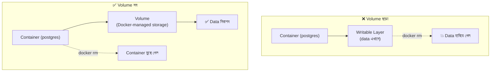
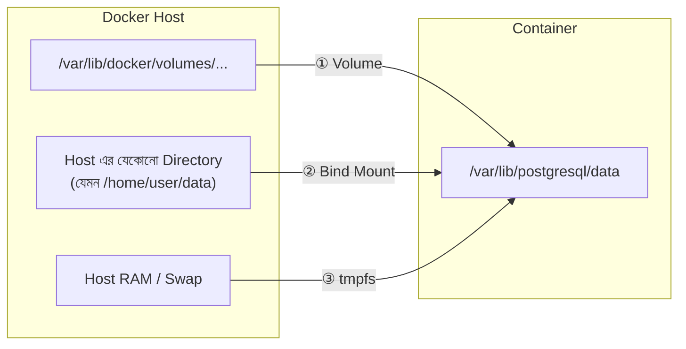

# Chapter 1: Docker Storage ও Database Persistence এর ভূমিকা

## 1.1 কেন সাধারণ Container Filesystem এ Database চলে না? (Ephemerality)

Docker container এর ভেতরের filesystem হলো **ephemeral** (অস্থায়ী)। Image এর read-only layer এর উপর container এর জন্য একটা পাতলা **writable layer** (`overlay2` driver) তৈরি হয়। Database এর data ওই layer এ লিখলে নিচের সমস্যাগুলো হয়:

| সমস্যা | ব্যাখ্যা |
|---|---|
| **Data loss** | `docker rm` করলে writable layer সহ সব data মুছে যায় |
| **Upgrade সমস্যা** | Database image upgrade মানে নতুন container, আর নতুন container এ আগের data থাকে না |
| **Performance overhead** | `overlay2` এর Copy-on-Write (CoW) mechanism heavy write workload এ ধীর |
| **Tight coupling** | Data এর lifecycle container এর lifecycle এর সাথে বাঁধা পড়ে যায় |
| **Backup কঠিন** | Container এর ভেতরের layer থেকে data আলাদা করা ও manage করা ঝামেলার |



### দ্রুত প্রমাণ (নিজে চালিয়ে দেখো)

```bash
# 1. Volume ছাড়া একটা Postgres চালাও
docker run -d --name test-db -e POSTGRES_PASSWORD=secret postgres:17

# 2. একটা table বানাও
docker exec test-db psql -U postgres -c "CREATE TABLE demo(id int);"

# 3. Container মুছে ফেলো
docker rm -f test-db

# 4. আবার চালাও — আগের table আর নেই!
docker run -d --name test-db -e POSTGRES_PASSWORD=secret postgres:17
docker exec test-db psql -U postgres -c "\dt"   # Did not find any relations.
```

> 💡 **কিছু image আসলে অজান্তেই anonymous volume বানায়।** Official `postgres`, `mysql`, `mongo` image এর Dockerfile এ `VOLUME` instruction আছে। তাই `-v` না দিলেও Docker একটা random-নামের **anonymous volume** বানায়। কিন্তু নাম না থাকায় এটা হারিয়ে ফেলা বা ভুলে prune করে দেওয়া খুব সহজ। সবসময় **named volume** ব্যবহার করবে।

---

## 1.2 Docker এর তিনটি Storage Mechanism



### ① Volume (Named Volume)
Docker নিজে create ও manage করে। Linux এ data থাকে `/var/lib/docker/volumes/` এর নিচে। **Database এর জন্য সবচেয়ে ভালো ও recommended পদ্ধতি।**

### ② Bind Mount
Host machine এর একটা **নির্দিষ্ট path** সরাসরি container এ mount হয়। তুমি path নিয়ন্ত্রণ করো, Docker করে না। Development ও config/seed file inject করার জন্য আদর্শ।

### ③ tmpfs Mount
Data থাকে শুধু **host এর RAM (ও swap) এ**, disk এ কিছুই লেখা হয় না। Container বন্ধ হলেই data শেষ। Temporary ও ultra-fast workload এর জন্য।

---

## 1.3 তুলনামূলক বিশ্লেষণ (Architectural Comparison)

| বৈশিষ্ট্য | Named Volume | Bind Mount | tmpfs |
|---|---|---|---|
| **Data কোথায় থাকে** | `/var/lib/docker/volumes/<name>/_data` | Host এর যেকোনো path | Host RAM/Swap |
| **কে manage করে** | Docker | তুমি (user) | Kernel |
| **Container delete হলে data** | ✅ থাকে | ✅ থাকে | ❌ মুছে যায় |
| **Host reboot হলে data** | ✅ থাকে | ✅ থাকে | ❌ মুছে যায় |
| **Portability** | ⭐⭐⭐ উচ্চ | ⭐ কম (path-dependent) | N/A |
| **Backup সহজতা** | ⭐⭐⭐ (`docker volume` CLI) | ⭐⭐ (সাধারণ file backup) | N/A |
| **Permission সমস্যা** | কম (Docker handle করে) | **বেশি (UID/GID mismatch)** | কম |
| **Performance (Linux)** | নেটিভ speed | নেটিভ speed | 🚀 সবচেয়ে দ্রুত |
| **Performance (Win/macOS)** | ভালো (VM এর ভেতরে) | ⚠️ ধীর (VM file sharing) | 🚀 দ্রুত |
| **Host থেকে সরাসরি file দেখা** | কঠিন | ✅ সহজ | ❌ অসম্ভব |
| **Remote/Cloud storage driver** | ✅ (NFS, cloud plugin) | ❌ | ❌ |
| **Production DB এর জন্য** | ✅ **Recommended** | ⚠️ সীমিত ক্ষেত্রে | ❌ কখনোই নয় |

---

## 1.4 Production Database এ কোনটা কখন?

| Use Case | সুপারিশ | কারণ |
|---|---|---|
| **Production database data** | **Named Volume** | Portable, Docker-managed, backup সহজ |
| **Production এ dedicated SSD/disk** | Named Volume + `driver_opts` | নির্দিষ্ট disk এ রাখা যায়, তবুও Docker-managed |
| **Local development** | Named Volume (data) + Bind Mount (config/seed) | Data নিরাপদ, config সহজে edit করা যায় |
| **Init SQL / seed script inject** | Bind Mount (`:ro`) | Host থেকে file দিয়ে container এ পাঠানো |
| **Config file (`postgresql.conf`, `my.cnf`)** | Bind Mount (`:ro`) | Version control এ রাখা যায় |
| **CI/CD test database** | **tmpfs** | অতি দ্রুত, শেষে নিজে থেকেই পরিষ্কার |
| **Redis session/cache (data হারালে সমস্যা নেই)** | tmpfs অথবা Named Volume | Persistence লাগবে কিনা তার উপর নির্ভর |

### Database অনুযায়ী Data Path ও Container User

| Database | Data Path (container এর ভেতরে) | Default User (UID) | Init Script Path |
|---|---|---|---|
| **PostgreSQL** (≤17) | `/var/lib/postgresql/data` | `postgres` (999*) | `/docker-entrypoint-initdb.d/` |
| **PostgreSQL** (18+) | `/var/lib/postgresql` ⚠️ | `postgres` (999*) | `/docker-entrypoint-initdb.d/` |
| **MySQL** | `/var/lib/mysql` | `mysql` (999) | `/docker-entrypoint-initdb.d/` |
| **MariaDB** | `/var/lib/mysql` | `mysql` (999*) | `/docker-entrypoint-initdb.d/` |
| **MongoDB** | `/data/db` (+ `/data/configdb`) | `mongodb` (999) | `/docker-entrypoint-initdb.d/` |
| **SQL Server** | `/var/opt/mssql` | `mssql` (10001) | — |
| **Redis** | `/data` | `redis` (999) | — |

> \* Debian-based image এ সাধারণত 999; Alpine-based image এ আলাদা হতে পারে (যেমন `postgres:alpine` এ UID 70)। নিশ্চিত হতে চালাও: `docker run --rm postgres:17 id postgres`

> ⚠️ **PostgreSQL 18+ এর পরিবর্তন:** নতুন official image এ data directory এখন major-version-specific subdirectory তে থাকে, তাই volume mount করতে হয় `/var/lib/postgresql` এ (`/var/lib/postgresql/data` এ নয়)। Upgrade এর আগে অবশ্যই [official image এর README](https://hub.docker.com/_/postgres) দেখে নিও। এই গাইডের example এ `postgres:17` ব্যবহার করা হয়েছে, আর 18+ এর জন্য শুধু mount path বদলাতে হবে।

> ⚠️ **Init script সতর্কতা:** `/docker-entrypoint-initdb.d/` এর script **শুধু প্রথমবার** চলে, যখন data directory **খালি** থাকে। Data আগে থেকে থাকলে script আর চলবে না।

---

🏠 [সূচিপত্র](../README.md) | [পরের: Chapter 2](02-named-volumes.md) ➡️
