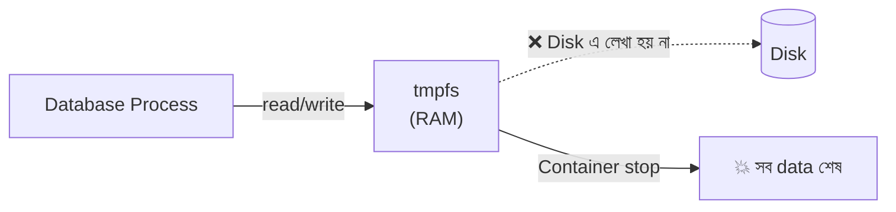

# Chapter 4: tmpfs Mounts (In-Memory Performance ও Caching)

> 📁 **Ready-to-run example:** [`examples/postgres/docker-compose.test.yml`](../examples/postgres/docker-compose.test.yml)

## 4.1 tmpfs কী?

`tmpfs` হলো একটা **temporary filesystem** যার data পুরোপুরি **host এর RAM এ** (প্রয়োজনে swap এ) থাকে, disk এ কখনো লেখা হয় না।



| বৈশিষ্ট্য | বিবরণ |
|---|---|
| **Speed** | RAM speed (disk এর চেয়ে বহুগুণ দ্রুত), `fsync` প্রায় তাৎক্ষণিক |
| **Persistence** | ❌ **নেই**। Container stop/restart/remove এ data যায় |
| **Sharing** | একাধিক container এর মধ্যে share করা যায় না |
| **Support** | Linux container এ (Windows container এ নয়) |
| **Size** | `size` option না দিলে সাধারণত host RAM এর ৫০% পর্যন্ত বাড়তে পারে |

---

## 4.2 Database এর জন্য Use Cases

| Use Case | কেন উপযোগী |
|---|---|
| **CI/CD test database** | প্রতি test run এ নতুন, পরিষ্কার ও অতি দ্রুত DB; শেষে নিজে থেকেই মুছে যায় |
| **Integration test suite** | Disk I/O বাদ, test কয়েক গুণ দ্রুত |
| **Temporary cache/session store** | Data হারালেও ক্ষতি নেই এমন Redis |
| **Sensitive temporary data** | Disk এ কিছু লেখা হয় না, তাই forensic ঝুঁকি কম |
| **Postgres temp space** | `temp_tablespaces` বা sort/temp file এর জন্য |
| **Benchmark** | Disk এর প্রভাব বাদ দিয়ে database engine এর খাঁটি performance মাপা |

---

## 4.3 CLI Example

```bash
# ───────── Postgres (test database) ─────────
docker run -d --name pg-test \
  -e POSTGRES_PASSWORD=test \
  --tmpfs /var/lib/postgresql/data:rw,noexec,nosuid,size=512m \
  -p 5433:5432 \
  postgres:17 \
  -c fsync=off -c synchronous_commit=off -c full_page_writes=off

# --tmpfs <path>:<options>  — path এ RAM-based filesystem বসাও
#   rw         : read-write
#   noexec     : এই filesystem থেকে কোনো binary চালানো যাবে না (নিরাপত্তা)
#   nosuid     : setuid bit উপেক্ষা (নিরাপত্তা)
#   size=512m  : সর্বোচ্চ ৫১২ MB (এর বেশি লিখলে "No space left on device")
#
# -c fsync=off ...  : ⚠️ শুধু TEST এর জন্য! Durability বন্ধ করে speed বাড়ায়।
#                     Production এ কখনো নয়।
```

```bash
# ───────── MySQL (CI test) ─────────
docker run -d --name mysql-test \
  -e MYSQL_ROOT_PASSWORD=test \
  --tmpfs /var/lib/mysql:rw,size=1g \
  mysql:8.4

# ───────── --mount syntax ─────────
docker run -d --name pg-test \
  -e POSTGRES_PASSWORD=test \
  --mount type=tmpfs,destination=/var/lib/postgresql/data,tmpfs-size=536870912,tmpfs-mode=1770 \
  postgres:17

# tmpfs-size : bytes এ (536870912 = 512 MiB)
# tmpfs-mode : file mode (octal)
# ⚠️ --mount এ key হলো "destination" (বা "target"), "source" নয় (tmpfs এর source নেই)
```

---

## 4.4 Docker Compose Configuration (Size Limit সহ)

### Short Syntax

```yaml
# docker-compose.test.yml
services:
  postgres-test:
    image: postgres:17
    environment:
      POSTGRES_PASSWORD: test
      POSTGRES_DB: testdb
    # Short syntax: <path>:<options>
    tmpfs:
      - /var/lib/postgresql/data:rw,noexec,nosuid,size=512m
    # ⚠️ tmpfs এর ব্যবহার container এর memory limit এর মধ্যে গণ্য হয়
    mem_limit: 1g
    shm_size: 256mb
    command: >
      postgres
      -c fsync=off
      -c synchronous_commit=off
      -c full_page_writes=off
      -c shared_buffers=128MB
    ports:
      - "5433:5432"
    healthcheck:
      test: ["CMD-SHELL", "pg_isready -U postgres"]
      interval: 3s
      timeout: 3s
      retries: 10
```

### Long Syntax (বেশি নিয়ন্ত্রণ)

```yaml
services:
  postgres-test:
    image: postgres:17
    environment:
      POSTGRES_PASSWORD: test
    volumes:
      - type: tmpfs
        target: /var/lib/postgresql/data     # Container এর path (source লাগে না)
        tmpfs:
          size: 536870912                    # Bytes এ: 512 MiB
          mode: 0o1770                       # File mode (optional)
```

> 📝 **Compose long syntax এ `size` bytes এ দিতে হয়।** Short syntax এ `size=512m` লেখা যায়। দুটো আলাদা format, এ নিয়ে মাঝে মাঝে বিভ্রান্তি হয়।

### Redis Session Store (tmpfs)

```yaml
services:
  redis-session:
    image: redis:7-alpine
    command: redis-server --save "" --appendonly no   # Disk persistence পুরো বন্ধ
    tmpfs:
      - /data:rw,size=256m
    mem_limit: 512m
    # --save ""        : RDB snapshot বন্ধ
    # --appendonly no  : AOF log বন্ধ
    # Container restart হলে সব session শেষ — এটাই প্রত্যাশিত
```

### CI Pipeline এ ব্যবহার (GitHub Actions)

```yaml
# .github/workflows/test.yml
name: Tests
on: [push]
jobs:
  test:
    runs-on: ubuntu-latest
    steps:
      - uses: actions/checkout@v4
      - name: In-memory test DB চালু করো
        run: docker compose -f docker-compose.test.yml up -d --wait
      - name: Test চালাও
        run: ./run-tests.sh
      - name: পরিষ্কার করো
        if: always()
        run: docker compose -f docker-compose.test.yml down -v
```

---

## 4.5 সীমাবদ্ধতা ও Data Loss এর ঝুঁকি

| ঝুঁকি / সীমাবদ্ধতা | ব্যাখ্যা |
|---|---|
| 🔴 **Data সম্পূর্ণ হারায়** | Container stop, **restart**, remove, host reboot, crash, প্রতিটি ক্ষেত্রে |
| 🔴 **Persistence নেই** | `docker restart` করলেও tmpfs খালি হয়ে যায় |
| 🟠 **Memory pressure** | বড় tmpfs → host RAM শেষ → **OOM Killer** container বা অন্য process মেরে ফেলতে পারে |
| 🟠 **Swap এ যেতে পারে** | RAM কম থাকলে tmpfs এর page swap এ চলে যায়, সম্পূর্ণ "disk-free" নিশ্চয়তা নেই |
| 🟠 **Memory limit এর সাথে যুক্ত** | `mem_limit` এ tmpfs এর usage ধরা হয়। Limit ছোট হলে container kill হতে পারে |
| 🟡 **Container এর মধ্যে share অসম্ভব** | একাধিক container একই tmpfs দেখতে পায় না |
| 🟡 **Size নির্ধারণ জরুরি** | না দিলে অনির্ধারিতভাবে RAM খেয়ে ফেলতে পারে |
| 🟡 **Windows container এ নেই** | শুধু Linux container |

> 🚫 **Golden Rule:** যে data হারালে ক্ষতি হবে, তা **কখনো** tmpfs এ রেখো না। Production এর primary database এর জন্য tmpfs সম্পূর্ণ নিষিদ্ধ।

---

⬅️ [আগের: Chapter 3](03-bind-mounts.md) | 🏠 [সূচিপত্র](../README.md) | [পরের: Chapter 5](05-production-best-practices.md) ➡️
